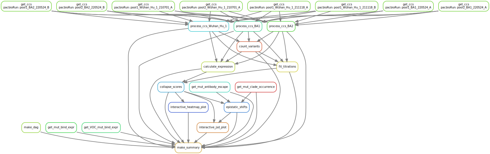

# Summary

Analysis run by [Snakefile](../../Snakefile)
using [this config file](../../config.yaml).
See the [README in the top directory](../../README.md)
for details.

Here is the DAG of the computational workflow:

Here is the Markdown output of each Jupyter notebook in the
workflow:

1. Get prior RBD DMS mutation-level binding and expression data from [original Wuhan-Hu-1 dimeric ACE2 DMS](https://github.com/jbloomlab/SARS-CoV-2-RBD_DMS),  [prior VOCs (WH1, Alpha, Beta, Delta, Eta) monomeric ACE2 DMS](https://github.com/jbloomlab/SARS-CoV-2-RBD_DMS_variants), and [Jesse's script to get counts of substitutions from UShER MAT broken by clade](https://github.com/jbloomlab/SARS2-RBD-DMS-evolution).

2. Process PacBio CCSs for each background: [Wuhan_Hu_1](process_ccs_Wuhan_Hu_1.md), [Omicron BA.1](process_ccs_BA1.md), [Omicron BA.2](process_ccs_BA2.md). Creates barcode-variant lookup tables for each background: [Wuhan_Hu_1](../variants/codon_variant_table_Wuhan_Hu_1.csv), [Omicron BA.1](../variants/codon_variant_table_BA1.csv), [Omicron BA.2](../variants/codon_variant_table_BA2.csv).

3. [Count variants by barcode](count_variants.md).
   Creates a [variant counts file](../counts/variant_counts.csv)
   giving counts of each barcoded variant in each condition.

4. [Fit titration curves](compute_binding_Kd.md) to calculate per-barcode KD, recorded in [this file](../binding_Kd/bc_binding.csv).

5. [Analyze Sort-seq](compute_expression_meanF.md) to calculate per-barcode RBD expression, recorded in [this file](../expression_meanF/bc_expression.csv).

6. [Derive final genotype-level phenotypes from replicate barcoded sequences](collapse_scores.md).
   Generates final phenotypes, recorded in [this file](../final_variant_scores/final_variant_scores.csv).

7. [Analyze patterns of epistasis in the DMS data and in SARS-CoV-2 genomic data](epistatic_shifts.md).

8. Make interactive data visualizations, available [here](https://jbloomlab.github.io/SARS-CoV-2-RBD_DMS_Omicron/)